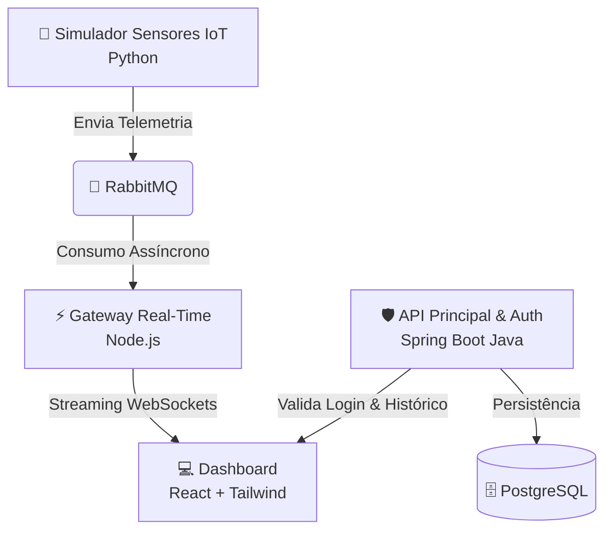

# 🏭 Plataforma de Monitoramento IoT Industrial


Uma arquitetura de microsserviços ponta a ponta para monitoramento em tempo real de telemetria de máquinas industriais (Temperatura, RPM e Vibração), protegida por autenticação criptográfica JWT e orquestrada inteiramente em containers Docker.

---

# ✨ Funcionalidades Principais

- **Streaming em Tempo Real:** Visualização instantânea da telemetria das máquinas via WebSockets, com atraso inferior a 1 segundo.
- **Alertas Dinâmicos:** Interface reativa que destaca máquinas em estado crítico (ex: Temperatura > 95°C ou Vibração > 5.0 mm/s) com efeitos visuais e mudança de cores.
- **Histórico Consolidado:** Gráfico interativo desenhando a linha do tempo da temperatura de toda a frota, consumido diretamente do banco relacional.
- **Segurança Ponta a Ponta:** Rotas da API REST e conexões de WebSocket totalmente protegidas por JSON Web Tokens (JWT).

---

# 🗺️ Arquitetura Visual

O fluxo de dados segue um padrão de produtor-consumidor, garantindo que o sistema continue estável mesmo sob alta carga de dados dos sensores IoT.



---

# 🛠️ Stack por Serviço

| Serviço | Tecnologia Base | Bibliotecas / Ferramentas |
|---|---|---|
| Frontend UI | React.js (Vite) | Tailwind CSS, Recharts, Socket.io-client |
| Gateway Real-Time | Node.js | Express, Socket.io, JsonWebToken, Amqplib |
| API Core & Auth | Java 17 | Spring Boot, Spring Security, io.jsonwebtoken |
| Mensageria | RabbitMQ | Protocolo AMQP, RabbitMQ Management |
| Banco de Dados | PostgreSQL | JPA/Hibernate via Spring |
| Simulador IoT | Python 3 | Pika, Time, Random |
| Infraestrutura | Docker | Docker Compose, Multi-container network |

---

# 🔒 Camada de Segurança (JWT Multi-Serviço)

O ecossistema implementa uma arquitetura de segurança descentralizada:

- O **Spring Boot** valida as credenciais e emite o token assinado.
- O **React** armazena o token e o envia:
  - No cabeçalho `Authorization` para requisições REST.
  - No objeto de autenticação do WebSocket.
- O **Node.js** intercepta a conexão WebSocket e valida a assinatura JWT antes de liberar o streaming em tempo real.

---

# 🚀 Como Executar o Projeto

Graças à conteinerização com Docker, você pode subir todo o ecossistema com apenas um comando.

## 📋 Pré-requisitos

- Docker
- Docker Compose

---

## ▶️ Passo a Passo

### 1. Clone o repositório

```bash
git clone https://github.com/MatheusFranciscoLS/plataforma-iot-industrial.git

cd plataforma-iot-industrial
```

### 2. Inicialize os containers

```bash
docker compose up -d --build
```

---

# 🌐 Serviços Disponíveis

| Serviço | URL |
|---|---|
| Dashboard React | http://localhost:5173 |
| API Java Spring | http://localhost:8080 |
| RabbitMQ Management | http://localhost:15672 |

---

# 💡 Credenciais de Teste

```txt
Usuário: admin
Senha: senha123
```

---

# 📈 Tecnologias e Conceitos Aplicados

- Microsserviços
- Mensageria Assíncrona
- Arquitetura Event-Driven
- WebSockets
- JWT Authentication
- Dockerização
- Comunicação em Tempo Real
- Producer / Consumer Pattern
- APIs REST
- Persistência Relacional
- Containers Multi-serviço

---

# 👨‍💻 Autor

Desenvolvido por Matheus Francisco.